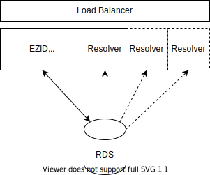

# Resolver Development

Notes on design and implementation of identifier resolution 
capability within the EZID application. These notes are for 
design purposes. Actual implementation may vary.


## Goal 

To support resolution of any identifier minted by the EZID application.

Identifier resolution is currently handled by N2T.net. The EZID application 
should provide at least equivalent capability for identifiers minted through 
the application.

N2T reports approximately one resolution per second on average for 
EZID identifiers over several months. The burst rate is not currently known.

## Initial Design

Since the resolver does not update the database, it can be implemented
as an application separate from the main EZID app. It is expected that
some portion of the code, particularly configuration, models, and other
lower level functionality may be shared by the resolver and EZID app.

Operating the resolver as a separate application provides some benefit:

* Resolution is available when EZID app is offline for maintenance etc.
* Resolution can be scaled by increasing threads within a resolver 
  instance and by increasing the number of resolver instances.
  


**Figure 1.** Overall architecture of application. The EZID app and 
Resolver operate as separate instances. The Load Balancer facilitates
resolver access to available instances through a single endpoint. The 
EZID app has read/write access to the database. A resolver instance
has read only access to the database.

## Query Performance

Query performance is critical for resolution. Query 
implementation and supporting indices should be carefully
considered to avoid table scans. It may be necessary to 
utilize a key / value store should database query performance 
not be adequate (e.g. memcached, redis, and similar). Such as store 
should support prefix key matching to support suffix pass through. 
That is, an identifier provided for resolution may contain a suffix 
of 0..n characters. The resolved identifier is determined by 
matching any known EZID identifier with the start of the provided 
identifier. 

A naive implementation might use something like the following. Given 
the table `identifiers` with identifier field `identifier`, find 
the record that matches the provided `resolve_me` string:

```sql
SELECT * FROM identifiers WHERE 'resolve_me' LIKE identifier || '%';
```

The stage-2 instance currently has 24120968 entries (42 sec) in the 
`ezidapp_storeidentifier` table. The maximum char length of the
`identifier` field is 156 (197 sec). The minimum is 12 (193 sec).

Given the identifier `ark:/13030/qt8n91c81t`, the query:

```sql
SELECT * FROM ezidapp_storeidentifier 
WHERE identifier = 'ark:/13030/qt8n91c81t'; 
```
returns immediately (0 sec).

The query:

```sql
SELECT * FROM ezidapp_storeidentifier 
WHERE 'ark:/13030/qt8n91c81t' LIKE identifier  || '%';
```
took xx second to complete (cancelled after 5 minutes). So clearly, 
the naive approach is inadequate.

```sql
SELECT COUNT(*) FROM ezidapp_storeidentifier 
WHERE INSTR('ark:/13030/qt8n91c81t', identifier) = 1;
```
took 184 seconds to complete.

Examining the current database schema, it appears there is no mechanism to directly support 
performant resolution while supporting suffix pass through. At a minimum, it
would be necessary to store `shoulder_id` in the `ezidapp_storeidentifier` table. 
This would at least enable a subquery to limit the identifier match query. 

```sql
select count(*), char_length(prefix) as c from ezidapp_shoulder group by c;
+----------+----+
| count(*) | c  |
+----------+----+
|       13 | 11 |
|       10 | 12 |
|      171 | 13 |
|       77 | 14 |
|       95 | 15 |
|      111 | 16 |
|        1 | 17 |
|        1 | 18 |
|        1 | 19 |
|        1 | 21 |
+----------+----+
```

One approach would be to search for progressive truncations of the provided
identifier. The range of character truncation could be constrained by the 
type of identifier and the known size ranges of the identifier types. A further 
performance gain may be achieved by method caching. Basically:

```python
def resolve(identifier):
    min_len, max_len = getLengthRange(identifier)
    epos = max_len
    while epos >= min_len:
      res = searchByIdentifier(identifier[:epos])
      if res is not None:
        return res
      epos = epos -1
    return None
```

Range of identifier lengths:

```sql
 select count(*) as cnt, 
        char_length(identifier) as cln, 
        left(identifier, 3) as pfx 
 from ezidapp_storeidentifier group by cln, pfx;
+----------+-----+-----+
| cnt      | cln | pfx |
+----------+-----+-----+
|        1 |  12 | ark |
|       43 |  13 | ark |
|     2215 |  14 | ark |
|     7487 |  15 | ark |
|        9 |  16 | ark |
|        6 |  16 | doi |
|   132568 |  17 | ark |
|        3 |  17 | doi |
|     3694 |  18 | ark |
|      633 |  18 | doi |
| 20382067 |  19 | ark |
|     8870 |  19 | doi |
|  2384060 |  20 | ark |
|    66833 |  20 | doi |
|   353832 |  21 | ark |
|     2663 |  21 | doi |
|   316535 |  22 | ark |
|    11753 |  22 | doi |
|    42129 |  23 | ark |
|     3889 |  23 | doi |
|      946 |  24 | ark |
|     1976 |  24 | doi |
|   112744 |  25 | ark |
|     4271 |  25 | doi |
|    19736 |  26 | ark |
|     5957 |  26 | doi |
|     4424 |  27 | ark |
|      425 |  27 | doi |
|     9035 |  28 | ark |
|      689 |  28 | doi |
|    89480 |  29 | ark |
|      642 |  29 | doi |
|    33303 |  30 | ark |
|      623 |  30 | doi |
|      114 |  31 | ark |
|     1571 |  31 | doi |
|     1718 |  32 | doi |
|        1 |  33 | ark |
|     4081 |  33 | doi |
|        3 |  34 | ark |
|     1561 |  34 | doi |
|     1177 |  35 | doi |
|      682 |  36 | doi |
|     1551 |  37 | doi |
|     1014 |  38 | doi |
|        1 |  39 | ark |
|     1076 |  39 | doi |
|      683 |  40 | doi |
|      369 |  41 | doi |
|      268 |  42 | doi |
|      439 |  43 | doi |
|      164 |  44 | doi |
|       15 |  45 | doi |
|       16 |  46 | doi |
|       29 |  47 | doi |
|        5 |  48 | doi |
|    97909 |  49 | doi |
|      936 |  50 | doi |
|      138 |  51 | doi |
|      142 |  52 | doi |
|      440 |  53 | doi |
|      852 |  54 | doi |
|      361 |  55 | doi |
|       46 |  56 | doi |
|        7 |  57 | doi |
|        3 |  58 | doi |
|        1 |  61 | doi |
|        1 |  63 | doi |
|        4 |  64 | doi |
|        1 |  68 | doi |
|        2 |  69 | doi |
|        1 |  70 | doi |
|        1 |  71 | doi |
|        1 |  79 | ark |
|        1 |  85 | doi |
|        1 |  90 | doi |
|        1 |  91 | doi |
|        9 |  93 | doi |
|        4 |  94 | doi |
|        2 |  95 | doi |
|        1 |  96 | doi |
|        1 |  98 | doi |
|        3 |  99 | doi |
|        2 | 101 | doi |
|        2 | 102 | doi |
|        5 | 105 | doi |
|        2 | 107 | doi |
|        1 | 109 | doi |
|        1 | 114 | doi |
|        1 | 115 | doi |
|        2 | 119 | doi |
|        2 | 125 | doi |
|        1 | 152 | doi |
|        1 | 156 | doi |
+----------+-----+-----+
```


